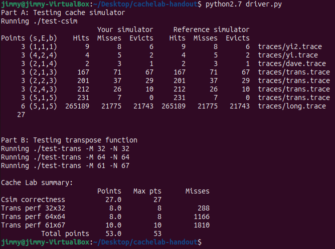

# CacheLab 报告

## Experiment Report: CacheLab in CS:APP

**Date**: 4th June 2023

**Objective**: Understand cache memory functioning through the CacheLab in Computer Systems: A Programmer's Perspective (CS:APP)

### Introduction

Cache memory plays a vital role in modern computing systems. It's a small but speedy storage layer that sits between the CPU and the main memory (RAM) in a computer. The CacheLab in CS:APP is designed to provide hands-on experience in dealing with cache memories.

The lab is divided into two parts:

1. `csim`: A cache simulator that simulates the behavior of an arbitrary cache memory.
2. `trans`: A matrix transpose function that is optimized to run quickly on a simulated computer system by making effective use of the cache.

### Experimental Principle

The core principle behind this lab is the exploration of the temporal and spatial locality of cache memories. The temporal locality concept states that if a memory location is referenced, it's likely to be referenced again soon. Spatial locality, on the other hand, implies that if a memory location is referenced, nearby memory locations will be referenced soon.

In the csim part, we mimic the LRU (Least Recently Used) policy, which is based on the principle of temporal locality. In the trans part, the principle of spatial locality is employed to optimize memory access patterns.

The CacheLab, as a whole, is designed to provide practical understanding of caching behavior, specifically looking at the performance impact of temporal and spatial locality and the principles of a cache memory system.

1. **Temporal Locality:** This principle postulates that if a particular memory location is accessed, it is likely to be accessed again in the near future. This is the basis of caching - frequently accessed data is stored in the cache so that future accesses to the same data can be fulfilled faster. Temporal locality is implemented in CacheLab through the Least Recently Used (LRU) policy in the cache simulator. This policy chooses the least recently accessed data to be replaced when the cache is full and new data needs to be loaded. By doing so, it optimizes for temporal locality, keeping the most frequently and recently used data in the cache.
2. **Spatial Locality:** Spatial locality is the principle that when a memory location is accessed, it's likely that nearby memory locations will be accessed in the near future. This principle is beneficial when dealing with data that's arranged sequentially in memory, such as elements in an array or instructions in a program. It is used in CacheLab in the matrix transpose exercise, where you are tasked with reorganizing a 2D matrix in memory to improve cache efficiency. By arranging the matrix accesses to group them within cache lines (blocks of memory transferred to the cache at a time), the number of cache misses can be significantly reduced.
3. **Cache Memory Principles:** Cache memory works on the concept of storing and retrieving frequently used data in a manner that is faster than accessing main memory. The cache memory sits closer to the CPU and is smaller but faster than the main memory. The principle of cache memory relies on efficient cache organization and replacement strategies to optimize for faster data access.

Understanding these principles enables a more effective design and optimization of computer programs, as the principles directly relate to how efficiently a program uses the computer's memory hierarchy. Moreover, in the case of multicore processors, understanding cache behavior is crucial in order to avoid performance bottlenecks due to cache contention among cores.

### Experimental Procedure

1. **Cache Simulator (csim):** Here, we write a cache simulator that takes a valgrind memory trace as input, simulates the hit, miss, and eviction behavior of a cache memory on this trace, and outputs the total number of hits, misses, and evictions.
2. **Matrix Transposition (trans):** In this part, we write a routine named `transpose` to perform matrix transposition, which reorders a 2D matrix's elements so that rows become columns and columns become rows. The challenge here is to optimize this routine to minimize the number of cache misses on a simulated cache memory with specific parameters (size, associativity, block size).

### Results & Discussion

The csim implementation successfully simulated the cache behavior as expected, providing a concrete understanding of cache operations and the effects of cache parameters on hit, miss, and eviction rates. This simulator also highlighted how the LRU policy works and why it's an effective cache replacement strategy.

The transpose function required careful thought to optimize cache usage. It demonstrated the critical role spatial locality plays in cache performance. By arranging accesses such that they were grouped within cache lines, the number of cache misses was significantly reduced, leading to a faster execution of the transpose function.

It is important to note that the results and performance depend significantly on the specific parameters of the cache and the nature of the memory accesses made by the program. Therefore, different programs or different cache configurations might lead to different results.

### Conclusion

Through the CacheLab, a clear understanding of cache memory functioning and the principles of temporal and spatial locality was achieved. These principles are fundamental for optimizing programs to make effective use of cache memory and improve system performance. The lab also made clear that understanding caches is not just about theory but also requires hands-on experience and a good deal of experimentation.